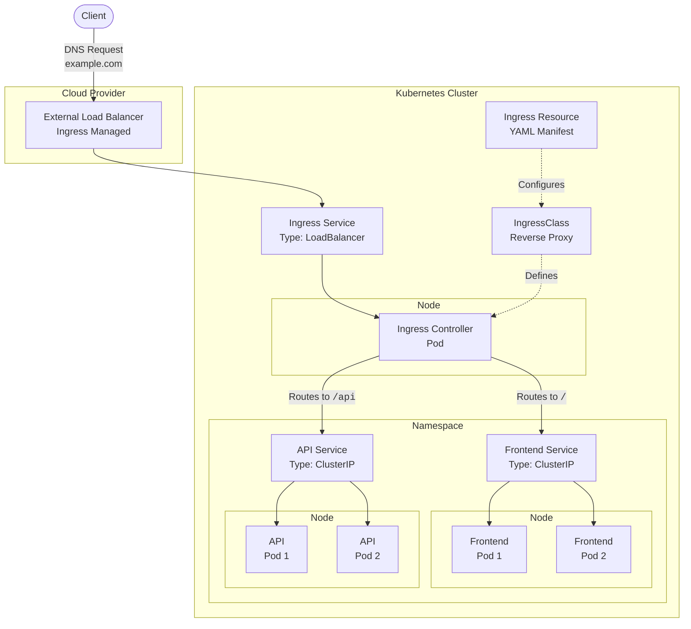

# Kubernetes

- [1. Details](#1-details)
  - [1.1. Conceptual Diagram](#11-conceptual-diagram)
  - [1.2. Order of Precedence](#12-order-of-precedence)
  - [1.3. Prerequisites](#13-prerequisites)
- [2. Usage](#2-usage)
  - [2.1. Task Runner](#21-task-runner)

## 1. Details

### 1.1. Conceptual Diagram



- Client
  > The *external* entity making an HTTP/HTTPS request to an application.

- Load Balancer
  > A *external* managed service provided by a cloud provider (AWS, GCP, Azure) outside of the Kubernetes cluster, created automatically by the Service of type `LoadBalancer`. Operates at Layer 4 (TCP/UDP) or Layer 7 (HTTP/HTTPS).

- Ingress Resource
  > A declarative Kubernetes API object that specifies routing rules (e.g., host-based, path-based) for external traffic. Centralized management as a single entry point for all HTTP/HTTPS traffic, security (TLS termination) and observability (logging, metrics).

- Ingress Service
  > A Kubernetes Service that targets the Pods of the Ingress Controller. Setting its type to `LoadBalancer`, instructs to provision an external load balancer to route traffic to the nodes on the specific `NodePort` of the service.

- IngressClass
  > A Kubernetes resource that defines the Ingress Controller to use for a specific Ingress Resource. It specifies the controller implementation (e.g., Nginx, Traefik) and its configuration.

- Ingress Controller
  > A reverse proxy server (Nginx, Traefik, or Envoy) running as a active component in a Pod within the cluster. Responsible for fulfilling the rules defined in the Ingress Resource.

- Services
  > - **LoadBalancer**: The Ingress Service of type `LoadBalancer` is created to provisions an external load balancer and expose the Ingress Controller to external traffic.
  > - **ClusterIP**: The Ingress Controller sends traffic to a regular Kubernetes Service of type `ClusterIP`. The Service is the internal default cluster communication to endpoints and load balancer, distributing traffic to the healthy Pods that match its *label selector*.

- Pods
  > The Ingress Controller routes traffic to internal ClusterIP Services, which then forward it to the application Pods.

### 1.2. Order of Precedence

Kustomize assembles and applies configuration in a defined hierarchy to ensure predictable overrides, lowest to highest:

- Base Resources
  > Loaded first from `resources:` in base kustomizations.

- Generators
  > ConfigMap- and Secret-generators (`configMapGenerator:`, `secretGenerator:`) produce new objects after base resources.

- Base Patches
  > Any `patches:` declared within base kustomizations are applied.

- Component Patches & Transformers
  > Imported via `components:`, these patches and transformers run next.

- Overlay Patches & Transformers
  > Specified in overlays (`patches:`, `transformers:`), they override earlier modifications.

- Overlay Direct Fields
  > Top-level settings in the overlay such as `namespace:`, `namePrefix:`, `commonLabels:`, `images:` are applied last, possessing the highest precedence.

### 1.3. Prerequisites

## 2. Usage

### 2.1. Task Runner

- [Makefile](Makefile)
  > Refer to the Makefile as the Task Runner file.

  > [!NOTE]
  > Run the `make help` command in the terminal to list the tasks used for the project.

  ```plaintext
  $ make help

  Task Runner
          A collection of tasks used in the current project.

  Usage
          make <task>

          bootstrap                       Initialize a software development workspace with requisites
          setup                           Install and configure all dependencies essential for development
          teardown                        Remove development artifacts and restore the host to its pre-setup state
          k8s-setup                       Set up the development environment using Docker Compose
          k8s-teardown                    Tear down the development environment using Docker Compose
          k8s-deploy-dependency-track     Deploy Kubernetes manifests for Dependency-Track
          k8s-destroy-dependency-track    Destroy Kubernetes manifests for Dependency-Track
          k8s-render-manifests            Render all Kubernetes manifests
          k8s-monitor-status              Monitor the status of all Kubernetes resources
          helm-vendor-charts              Vendor all Helm charts
          helm-render-charts              Render all Helm charts
  ```
