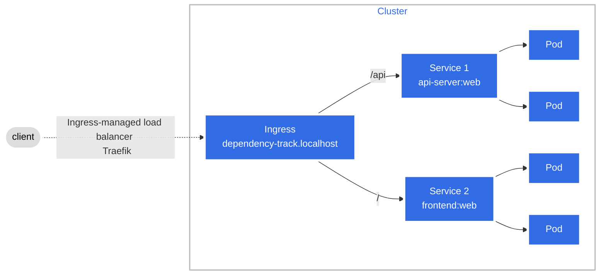

# Traefik

- [1. Usage](#1-usage)
  - [Ingress Controller](#ingress-controller)
  - [1.1. TLS Certificate](#11-tls-certificate)
    - [1.1.1. Self-Signed TLS Certificate](#111-self-signed-tls-certificate)
    - [1.1.2. TLS Secret Configuration](#112-tls-secret-configuration)

## 1. Usage

### Ingress Controller

The [TraefikIngress Controller](https://doc.traefik.io/traefik/providers/kubernetes-ingress/) for [Kubernetes](https://kubernetes.io/docs/concepts/services-networking/ingress-controllers/) is configured to manage ingress resources in the Kubernetes cluster.



### 1.1. TLS Certificate

#### 1.1.1. Self-Signed TLS Certificate

The overlay uses a self-signed TLS certificate for local development. The certificate files are included in the overlay directory and referenced in the `kustomization.yaml` file.

> [!TIP]
> mkcert is used to generate the certificate, which is suitable for local development and testing purposes. The certificate is not trusted by default, add the self-signed certificate to the browser's trust store or disable certificate verification in API clients.

- Domain
  > Generate a self-signed certificate for the single hostname.

  ```bash
  mkcert dependency-track.localhost
  ```

- Subdomains
  > Generate a self-signed certificate for the domain and subdomains.

  ```bash
  mkcert dependency-track.localhost api.dependency-track.localhost
  ```

#### 1.1.2. TLS Secret Configuration

- `kustomization.yaml`
  > The TLS secret is configured in the `kustomization.yaml` file of the `overlays`. It uses the generated certificate files to create a Kubernetes secret of type `kubernetes.io/tls`.

  ```yaml
  secretGenerator:
    - name: dependency-track-tls
      namespace: dependency-track
      type: "kubernetes.io/tls"
      files:
        - tls.crt=dependency-track.localhost+1.pem
        - tls.key=dependency-track.localhost+1-key.pem
  generatorOptions:
    disableNameSuffixHash: true
  ```
